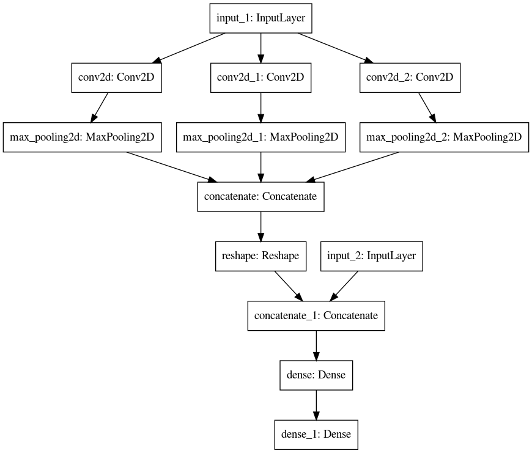

# New Keras implementation of " Deep Learning-Based Document Modeling for Personality Detection from Text "

##### [An old implementation of the paper](https://github.com/SenticNet/personality-detection) was made by the authors with Python 2 and Theono , in this version the model architecture is more understandable from the [code](https://github.com/laifi/BigFive/blob/master/model.py)
##### The memory consummation is optimized in this work

This code implements the model discussed in  [Deep Learning-Based Document Modeling for Personality Detection from Text](http://sentic.net/deep-learning-based-personality-detection.pdf)  for detection of Big-Five personality traits, namely:

-   Extroversion
-   Neuroticism
-   Agreeableness
-   Conscientiousness
-   Openness

